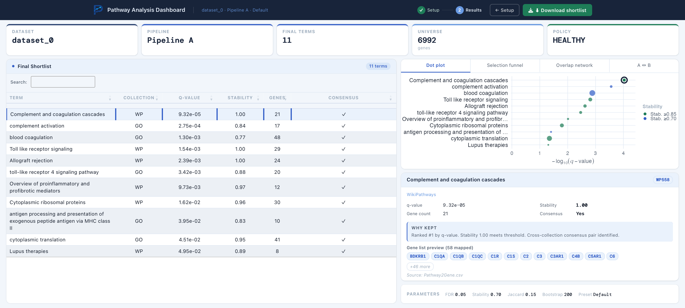
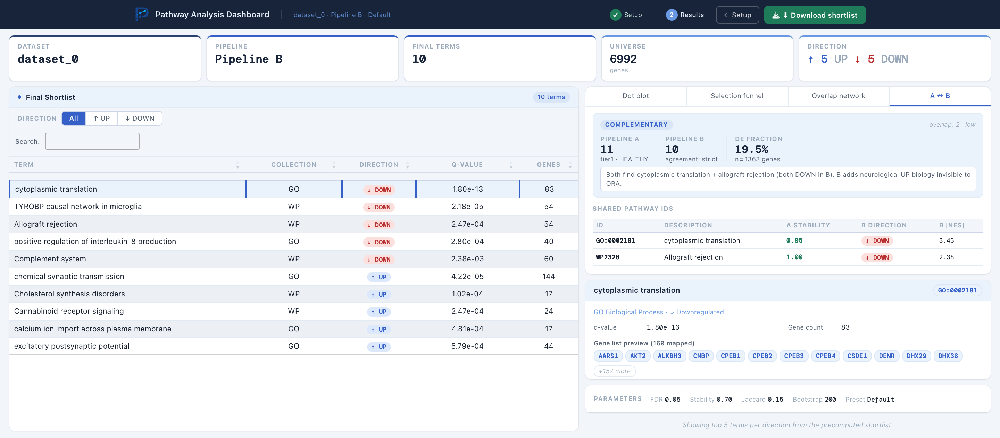

<div align="center">

# MaRBLe 2.0 — Pathway Analysis of RNA-seq Data
### Reducing Redundancy and False Positives

**Yustyna Babichuk**
BSc Data Science & Artificial Intelligence · Maastricht University
Honours research project — *Maastricht Research Based Learning (MaRBLe 2.0)*

Supervisors: Rachel Cavill · Jarno Koetsier · Pepijn Saraber


<br>



<sub><em>The Shiny dashboard — Pipeline A results for <code>dataset_0</code>: final shortlist, dot plot, and per-pathway detail.</em></sub>

</div>

---

## Overview

RNA sequencing produces long lists of differentially expressed genes that are
difficult to interpret directly. Pathway and Gene Ontology (GO) enrichment
analysis makes these results more interpretable by summarising gene-level changes
into biological processes and pathways — but it carries two well-known
weaknesses. First, enriched-pathway lists are often **long and redundant**: many
pathways and GO terms share genes or describe closely related processes, which
produces near-duplicate results that are hard to read. Second, many enrichment
methods implicitly **assume genes are independent**, even though genes in the
same pathway are frequently co-expressed; ignoring this gene–gene correlation
inflates pathway-level significance and increases false positives.

This project develops and compares **two complementary pathway-analysis
pipelines** that reduce redundancy and false positives while preserving
biologically meaningful signal. Both operate on the same RNA-seq input and the
same measured-gene background, but differ in their enrichment strategy and in how
pathway-level results are filtered and summarised. **Pipeline A** follows a
traditional over-representation approach combined with semantic and overlap-based
redundancy reduction, bootstrap stability, and cross-collection consensus.
**Pipeline B** combines a correlation-aware competitive gene-set test (CAMERA)
with a ranked, cutoff-free enrichment analysis (fgsea), followed by
agreement-based filtering and redundancy reduction. Explicitly accounting for
gene–gene correlation and pathway redundancy leads to more compact and
interpretable enrichment results.

The framework was then **evaluated across multiple RNA-seq datasets** that differ
in differential-expression signal, pathway coverage, and overlap between GO and
WikiPathways. It generalised across datasets, but the reliability of the final
shortlist depended strongly on dataset properties. A **dataset-aware threshold
policy** improved Pipeline A in borderline cases — relaxing the consensus
threshold while keeping the stability requirement strict — though it also showed
that low coverage or missing cross-collection overlap cannot be solved by
thresholds alone. A **Pipeline B ablation study** found that overlap clustering
had the strongest effect on the candidate pool, while the final top-N cap mainly
acts as a presentation choice. Throughout, the two pipelines proved
**complementary rather than redundant**: Pipeline A is strongest when a reliable
DE gene list is available, while Pipeline B adds directionality and stays useful
when differential expression is weak. Finally, an **interactive Shiny dashboard**
was built to make the final results easy to inspect, compare, and interpret.

This work was carried out over two semesters of the MaRBLe honours programme:
Semester 1 designed and validated the two pipelines on a reference dataset;
Semester 2 generalised the framework across datasets and added the threshold
policy, simulation studies, ablation, cross-pipeline comparison, and dashboard.

> 📄 **Full write-up:** [Semester 1 report](reports/marble_report_semester1.pdf) ·
> [Semester 2 report](reports/marble_report_semester_2.pdf). This repository holds
> the code, the publicly shareable datasets, and the precomputed results behind
> those reports.

---

## ▶️ Run the dashboard

The dashboard runs **straight from a fresh clone** — the precomputed results are
included, so there is nothing to recompute. You only need three R packages
(`shiny`, `DT`, `ggplot2`); the heavy Bioconductor pipeline stack is **not**
required just to view results.

From the **project root**, one command:

```bash
Rscript run_dashboard.R
```

This installs the three packages if they are missing and opens the app in your
browser. Equivalently, from an R session:

```r
install.packages(c("shiny", "DT", "ggplot2"))
shiny::runApp("shiny")
```

In the app: pick a **dataset** and a **pipeline**, click **Load shortlist**, and
explore the dot plot, selection funnel, overlap network, per-pathway detail
panel, and the **A ↔ B comparison** tab. The displayed shortlist can be exported
as CSV.

> Optional: installing `org.Hs.eg.db` + `AnnotationDbi` (Bioconductor) additionally
> shows the gene members behind each GO term. The dashboard works fine without
> them — it just skips that lookup.

<div align="center">



<sub><em>The <strong>A ↔ B</strong> tab (<code>dataset_0</code>): the complementarity summary, shared pathway IDs across both pipelines, and per-pathway detail.</em></sub>

</div>

---

## Methods at a glance

**Pipeline A — trust-first over-representation analysis**

```
DE gene list ─▶ ORA (GO-BP + WikiPathways) ─▶ semantic collapse (GO, Wang)
            ─▶ overlap clustering (Jaccard) ─▶ bootstrap stability (B = 200)
            ─▶ GO↔WP consensus ─▶ Tier 1 / Tier 2 / candidates
```

**Pipeline B — correlation-aware, ranked, cutoff-free**

```
expression matrix ─▶ CAMERA  +  fgsea ─▶ agreement filter (both, same direction)
                  ─▶ semantic collapse ─▶ overlap clustering
                  ─▶ top-N per direction (UP / DOWN shortlist)
```

| | **Pipeline A** | **Pipeline B** |
|---|---|---|
| **Strategy** | ORA (over-representation) | CAMERA + fgsea (competitive / ranked) |
| **Input** | DE gene list + measured-gene universe | full expression matrix |
| **Handles gene–gene correlation** | indirectly | **yes** (CAMERA) |
| **Redundancy reduction** | semantic collapse + Jaccard clustering | semantic collapse + Jaccard clustering |
| **Stability** | bootstrap resampling (B = 200) | — |
| **Direction (UP/DOWN)** | — | **yes** |
| **Output** | Tier 1 (stable + consensus) → Tier 2 (stable) → candidates | top-N per direction (default 5 UP + 5 DOWN) |
| **Entry point** | `R/run_pipelineA.R` | `R/run_pipelineB.R` |

The two pipelines are **complementary, not competing**: Pipeline A is strongest
when a reliable DE gene list is available, while Pipeline B adds directionality
and stays informative when gene-level differential expression is weak.

---

## Key findings

- **The framework generalises across datasets**, but the reliability of the final shortlist tracks dataset properties — DE signal strength, pathway coverage, and GO↔WP overlap — rather than failing in one uniform way.
- **Dataset-aware thresholds recover borderline cases.** Relaxing the consensus Jaccard threshold while keeping the stability requirement strict raised `dataset_3` from 2 → 8 Tier-1 pathways, and `ACTA2KO` from 4 → 9, without weakening stability.
- **Redundancy reduction is not cosmetic.** A Pipeline B ablation showed that *overlap clustering* most strongly shapes the candidate pool, while the final top-N cap is mainly a presentation choice.
- **A and B agree rarely but usefully.** Exact pathway-ID overlap is low (0–2 per dataset); where it occurs it carries extra confidence because two different designs converge.
- **A dashboard ties it together**, turning multiple output files into one interactive inspection and comparison layer.

---

## Repository layout

```
run_dashboard.R            One-command dashboard launcher
R/
  run_pipelineA.R          Pipeline A entry point
  run_pipelineB.R          Pipeline B entry point
  pipelineA/steps/         Step scripts 01–07 + step98 (final export)
  pipelineB/steps/         Step scripts 01–06
  analysis/                Diagnostics, threshold sweep & policy, simulations, plots
  ablation/                Pipeline B component-ablation experiment
  utils/                   Shared utilities (config, gene-ID conversion, …)
config/
  default.yml              Active dataset, pipeline parameters, thresholds
  ablation/                Ablation variant configs
data/                      Publicly shareable datasets (expression + metadata + DE stats)
results/                   Precomputed pipeline + analysis outputs (curated, dashboard-ready)
report_assets/             Publication-ready figures (PNG) and source tables
shiny/                     Interactive dashboard  (see shiny/README.md)
renv.lock                  Locked package versions for full reproducibility
```

---

## Datasets

| Dataset | Description | Gene IDs |
|---|---|---|
| `dataset_0` | Reference cohort — full transcriptome (Semester-1 baseline) | SYMBOL |
| `dataset_1` | GSE199939 | ENTREZ |
| `dataset_2` | GSE243836 — focused panel (~2,200 genes; low-coverage case) | ENTREZ |
| `dataset_3` | GSE247345 | ENTREZ |
| `ACTA2KO_iVSMC` | ACTA2 knockout vs wild-type in iVSMC (Biochemistry collaboration) | ENSEMBL → SYMBOL |

All datasets share one pathway annotation,
`data/dataset_0/processed/Pathway2Gene.csv` (GO Biological Process + WikiPathways).
The enrichment universe is always the intersection of measured genes and
annotated pathway genes, so enrichment is only tested against genes that could
have been observed.

> Additional vascular smooth-muscle-cell datasets from the Biochemistry
> collaboration (`Aneurysm_pVSMC`, `PAR1KO_iVSMC`, `Lineages_iVSMC`) were part of
> the study but are **withheld pending publication** and are intentionally not
> included in this public repository.

---

## Re-running the pipelines (optional)

Re-running Pipeline A/B requires the full analysis stack, pinned with
[renv](https://rstudio.github.io/renv/):

```r
if (!requireNamespace("renv", quietly = TRUE)) install.packages("renv")
renv::restore()   # heavy: CRAN + Bioconductor (clusterProfiler, fgsea, limma, …)
```

> **Note:** if `renv::restore()` fails on `RcppArmadillo` (a gfortran compile
> error on newer macOS), install the affected CRAN packages as binaries:
> `install.packages(<pkg>, type = "binary")`.

Then edit `config/default.yml` to select a dataset (exactly one `dataset:` block
uncommented — `dataset_0` is the default) and run:

```bash
Rscript R/run_pipelineA.R   # ORA + redundancy reduction + bootstrap + tiers
Rscript R/run_pipelineB.R   # CAMERA + fgsea + semantic collapse + top-N shortlist
```

Outputs are written to `results/pipelineA/<run_dir>/` or `results/pipelineB/<run_dir>/`.

### Post-run analysis (`R/analysis/`)

| Script | Purpose |
|---|---|
| `00_diagnostics.R` | Per-dataset / per-pipeline summary table |
| `01_sweep_pipelineA.R` | Threshold-sensitivity sweep for Pipeline A |
| `02_expressed_fraction.R` | Expression-coverage QC for final pathways |
| `03_threshold_policy.R` | Dataset classification + recommended thresholds |
| `04_run_with_policy.R` | Run Pipeline A with auto-selected thresholds |
| `05_simulation.R` | Simulation studies (coverage & signal) for threshold behaviour |
| `06_plot_stability_vs_significance.R` | Stability-vs-significance figure |

`R/ablation/` holds the Pipeline B component-ablation experiment
(`run_ablation_B.R` + comparison scripts), configured by `config/ablation/`.

### Key configuration (`config/default.yml`)

- `dataset:` — the active dataset (expression + metadata + statistics files)
- `gene_id_type:` — `SYMBOL` | `ENTREZ` | `ENSEMBL` (Pipeline B normalises to SYMBOL)
- `TAU_STABILITY:` — bootstrap stability threshold (Pipeline A, default `0.70`)
- `CONS_JACCARD_MIN:` — cross-collection consensus Jaccard threshold (default `0.15`)
- `agreement_mode:` — `intersection` | `relax_fdr_then_topn` (Pipeline B step 03)

---

## Run it on your own data

The pipelines are config-driven, so analysing a new dataset means dropping in
three files and editing one block of `config/default.yml`.

**1 · Add the data.** Create a folder under `data/`, e.g. `data/my_dataset/`, with:

| File | What it is |
|---|---|
| **expression matrix** | normalised expression values, genes × samples (CSV; gene IDs in the first column / row names) |
| **sample metadata** | one row per sample, with a sample-ID column and a group / condition column |
| **DE statistics** | gene-level differential-expression table (e.g. a limma `topTable`): gene, log2 fold change, p-value, adjusted p-value |

Pathway annotations are shared — every dataset reuses
`data/dataset_0/processed/Pathway2Gene.csv` (GO-BP + WikiPathways), so you don't
need to supply your own.

**2 · Point the config at it.** In `config/default.yml`, comment out the active
`dataset:` block and add one for your data (only one may be uncommented at a time):

```yaml
dataset:
  name:                 "my_dataset"
  expression_file:      "data/my_dataset/expression.csv"
  metadata_file:        "data/my_dataset/metadata.csv"
  statistics_file:      "data/my_dataset/topTable.csv"
  pathway2gene_file:    "data/dataset_0/processed/Pathway2Gene.csv"
  gene_col:             "Gene Symbol"   # gene-name column in the statistics file
  p_adjusted_preferred: true
  p_col_adj:            "adj. p-value"  # adjusted p-value column
  log2fc_col:           "log2FC"
  abs_log2fc_min:       null
  sample_id_col:        "SampleID"      # sample-ID column in the metadata
  group_col:            "Genotype"      # group / condition column in the metadata
  gene_id_type:         "SYMBOL"        # SYMBOL | ENTREZ | ENSEMBL
```

Set `gene_id_type` to match your gene IDs — Pipeline B converts `ENTREZ` /
`ENSEMBL` to gene symbols automatically. Adjust the column names to match your
files (the pipeline validates them on startup and tells you if one is missing).

**3 · Run.** After restoring the environment (`renv::restore()`):

```bash
Rscript R/run_pipelineA.R   # and / or
Rscript R/run_pipelineB.R
```

Each run creates a timestamped folder `results/pipelineA/<timestamp>/`; the final
shortlist is `FINAL/FINAL.csv` inside it.

**4 · View it in the dashboard (optional).** The dashboard auto-detects any
folder under `data/`. To make it load your Pipeline A run, add one row to
`results/run_registry.csv`:

```csv
my_dataset,results/pipelineA/<your-timestamp>,data/dataset_0/processed/Pathway2Gene.csv
```

Then launch the dashboard (`Rscript run_dashboard.R`) and select `my_dataset`.

---

## Acknowledgements

Carried out within the **MaRBLe 2.0** honours programme at Maastricht
University, in collaboration with the Department of Biochemistry. Thanks to
supervisors **Rachel Cavill**, **Jarno Koetsier**, and **Pepijn Saraber** for
their guidance throughout the project.

## License

Academic project shared for review and as a portfolio reference. Please get in
touch before reusing the code or data.
